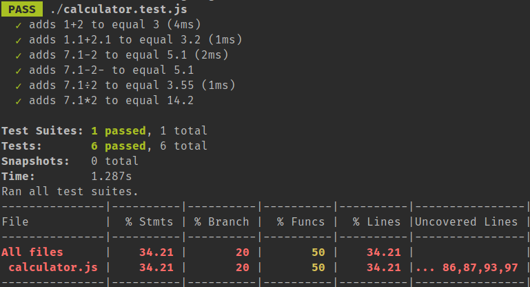

# jest testing framework getting started
https://facebook.github.io/jest/docs/en/getting-started.html

# install jest and run tests
```
sudo npm install -g jest
jest --coverage
```

# example output with coverage

